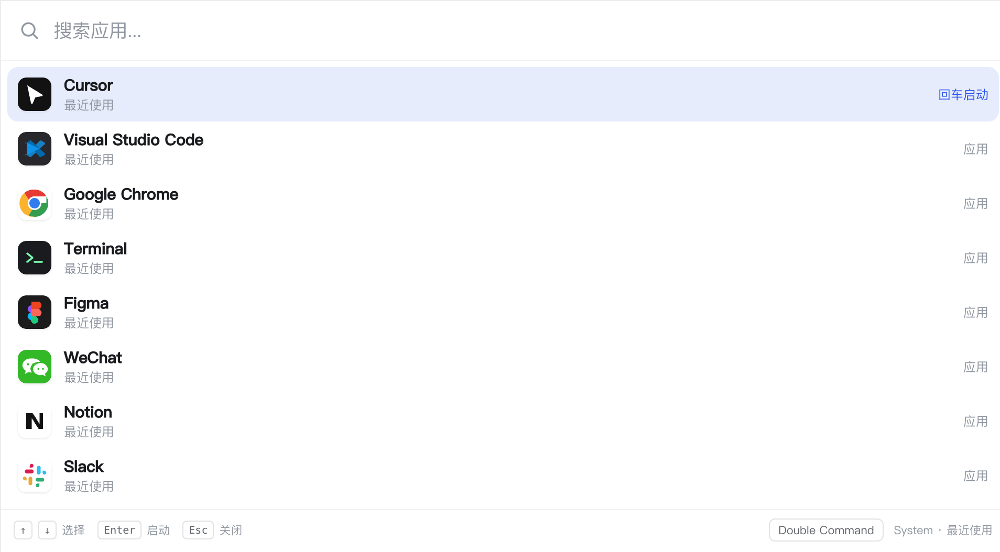
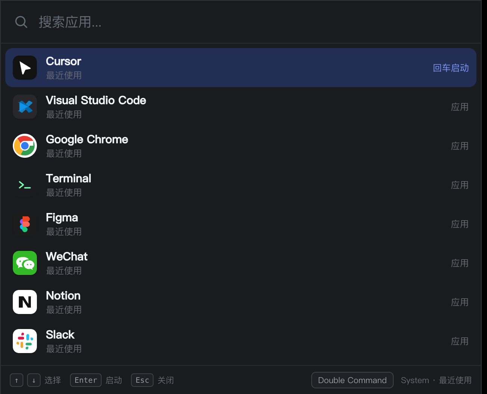
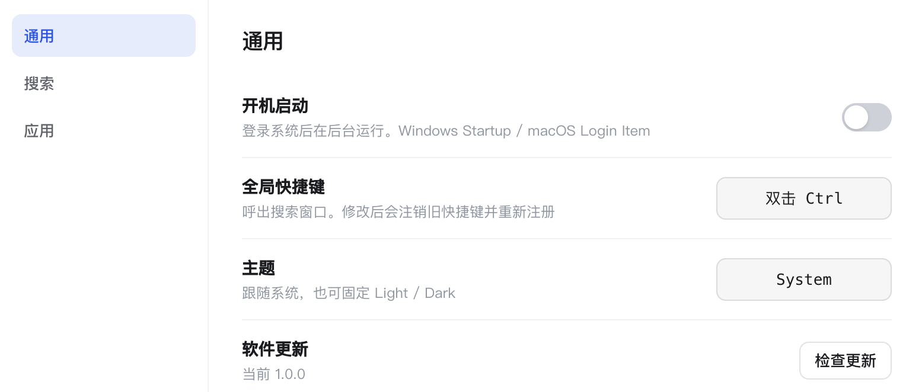
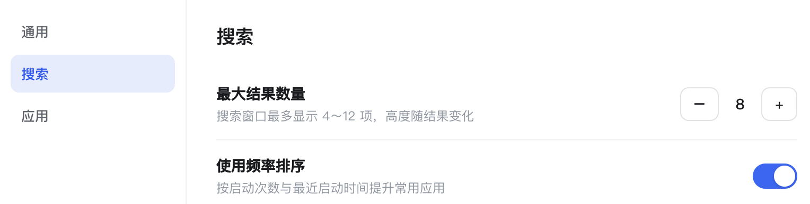

[中文文档](./README-zh.md)

  

<h1 align="center">Quka</h1>

  A minimal app launcher for Windows and macOS. 
  Double-tap a modifier key, type a few letters, press Enter.

  
  

Quka stays in the menu bar on macOS and the system tray on Windows. It indexes apps you already have installed, then gets out of the way until you need it — in the same spirit as Listary, Alfred, or Raycast, but focused on one job: **find an app and launch it**.

## Screenshots

  

  
  &nbsp;
  

  

## Features

- **Double-tap to open** — Command on macOS, Ctrl on Windows. Switch to Alt or the other modifier in Settings.
- **Fast local search** — Type part of a name. Chinese names also match pinyin and initials.
- **Recent apps first** — An empty query shows what you launched last.
- **Usage ranking** — Frequently used apps float higher as you keep launching them.
- **Finds installed apps** — Scans the apps already on your Mac or PC, and keeps their icons locally.
- **Stays in the background** — Menu bar / tray app. No Dock icon after install on macOS.
- **Light, dark, or system theme**
- **English and 简体中文** — follows the system language, or pick one in Settings
- **Launch at login**
- **In-app updates** from GitHub Releases

## Install

Download the latest build from [Releases](https://github.com/tomiaa12/Quka/releases/latest).

| Platform | Installer |
| --- | --- |
| Windows | `.exe` or `.msi` |
| macOS (Apple Silicon) | `.dmg` |
| macOS (Intel) | `.dmg` |

On Windows, the installer can download WebView2 if it is missing, then start Quka in the background.

On macOS, drag `Quka.app` into Applications. The first time you use the global shortcut, allow Quka under **System Settings → Privacy & Security → Accessibility**.

## Usage

1. Double-tap **Command** (macOS) or **Ctrl** (Windows).
2. Type part of an app name, or pick from recents.
3. Press **Enter** to launch. **Esc** hides the window.

The tray / menu bar icon can also open search, open Settings, rescan apps, or quit.

| Key | Action |
| --- | --- |
| `↑` `↓` | Move selection |
| `Enter` | Launch |
| `Esc` | Hide |
